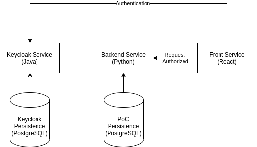
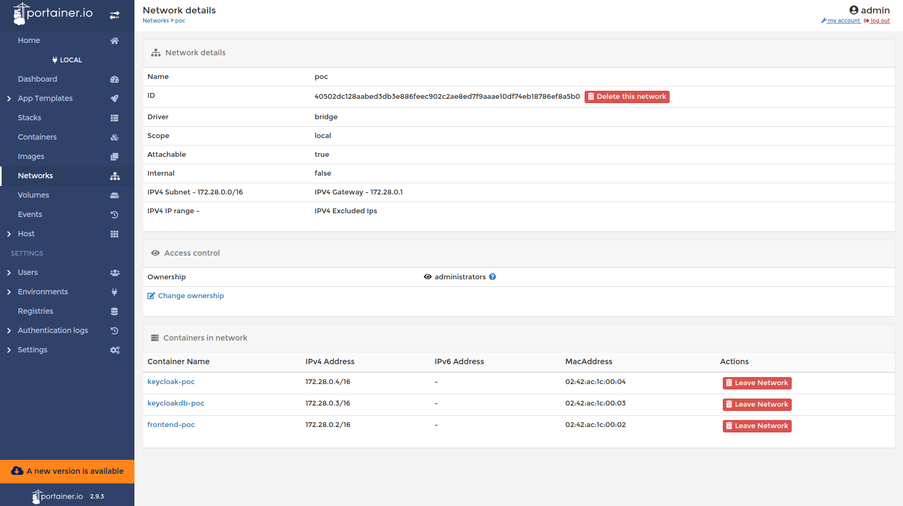

# Description

Poc Iam Microservice Deployment

## Iam PoC Architecture


## Docker Network Containers


## Create and start service
```shell
docker-compose up -d
```

## Stop service
```shell
docker-compose stop
```

## Restart service
```shell
docker-compose start
```

## Remove service resources
```shell
docker-compose down
```

## Get service logs
```shell
docker-compose logs

