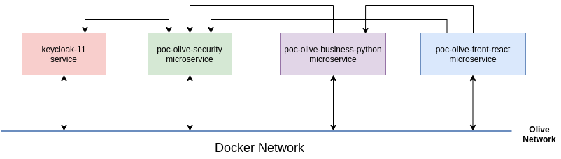
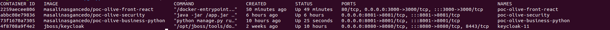

# Description

Poc Olive Microservice Deployment



## Create docker network

```shell
docker network create olive
```

# Security Microservice Deployment

## Build docker images

```shell
docker build -t masalinasgancedo/poc-olive-security .
```

## Start docker container

```shell
docker run -d -p 8081:8081 --name poc-olive-security masalinasgancedo/poc-olive-security
```

## Connect docker container to network

```shell
docker network connect olive poc-olive-security
```

## Check logs container

```shell
docker logs -f poc-olive-security
```

## Login inside container

```shell
docker exec -it poc-olive-security /bin/bash
```
# Busniness PHP Microservice Deployment

## Build docker images

```shell
docker build -t masalinasgancedo/poc-olive-business-php .
```

## Start docker container

```shell
docker run -d -p 8000:8000 --name poc-olive-business-php masalinasgancedo/poc-olive-business-php
```

## Connect docker container to network

```shell
docker network connect olive poc-olive-business-php
```

## Check logs container

```shell
docker logs poc-olive-business-php
```

## Login inside container

```shell
docker exec -it poc-olive-business-php /bin/bash
```

# Busniness Python Microservice Deployment

## Build docker images

```shell
docker build -t masalinasgancedo/poc-olive-business-python .
```

## Start docker container

```shell
docker run -d -p 8001:8001 --name poc-olive-business-python masalinasgancedo/poc-olive-business-python
```

## Connect docker container to network

```shell
docker network connect olive poc-olive-business-python
```

## Check logs container

```shell
docker logs poc-olive-business-python
```

## Login inside container

```shell
docker exec -it poc-olive-business-python /bin/bash
```

# React Microservice Deployment

## Build docker images

```shell
docker build -t masalinasgancedo/poc-olive-front-react .
```

## Start docker container

```shell
docker run -d -p 3000:3000 --name poc-olive-front-react masalinasgancedo/poc-olive-front-react
```

## Connect container to network

```shell
docker network connect olive poc-olive-front-react
```

## Check logs container

```shell
docker logs -f poc-olive-front-react
```

## Login inside container

```shell
docker exec -it poc-olive-front-react /bin/bash
```

## Stop/Start all containers

```shell
docker start keycloak-11 poc-olive-business-python poc-olive-security poc-olive-front-react
```

```shell
docker stop keycloak-11 poc-olive-business-python poc-olive-security poc-olive-front-react
```

## Docker containers

